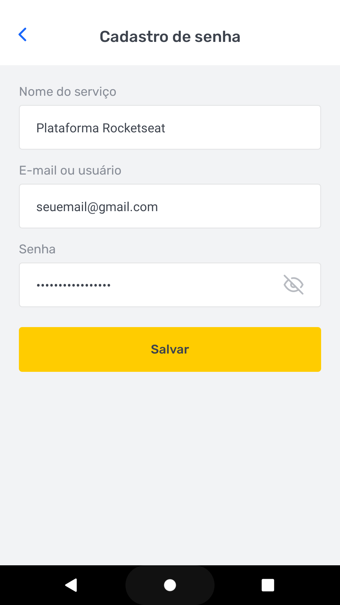

# SavePass


## 💻 Sobre o projeto
  aplicação de gerenciamento de senhas.
  Projeto Feito como desafio para o treinamento Ignite da RockeSeat.

  

[Projeto feito em conjunto com o treinamento IGNITE da RocketSeat ](https://rocketseat.com.br/)

## Features

- [x] Buscar e armazenar dados no AsyncStorage
- [x] Procurar Senhas salvas
- [x] Mostrar ou esconder senha


## 🎨 Template

O Template da aplicação está disponível no Figma:

https://github.com/rocketseat-education/ignite-template-react-native-savepass

Template disponibilizado pela RocketSeat.

## 🚀 Como executar o projeto (dev) / Getting Started

Clone Project 
```
$ git clone https://github.com/Fpos0/SavePass.git
```

```
# Install the dependencies
$ yarn

# Run the Expo server
$ expo start

```


## 🛠 Tecnologias

As seguintes ferramentas foram usadas na construção do projeto:

-   **[ReactNative](https://reactnative.dev/)**
-   **[TypeScript](https://www.typescriptlang.org/)**
-   **[Expo](https://expo.io/)**
-   **[Styled Component](https://styled-components.com/)**


## Imagens 
<h3 >
  Tela Home
</h3>
 

 <h3 >
  Tela Home mostrando a senha
</h3>
 

<h3 >
  Tela Register
</h3>
 


### Autor
---


 
 <br />
 <sub><b>Flavio Segundo</b></sub></a> <a href="https://github.com/Fpos0">🚀


Feito por Flavio Segundo 👋🏽 Entre em contato!

[](https://www.linkedin.com/in/flavio-p-o-segundo-889b25108/) 
| 
[](mailto:flaviofpos@hotmail.com)

## License
[MIT](https://choosealicense.com/licenses/mit/)
